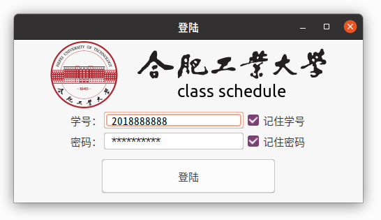
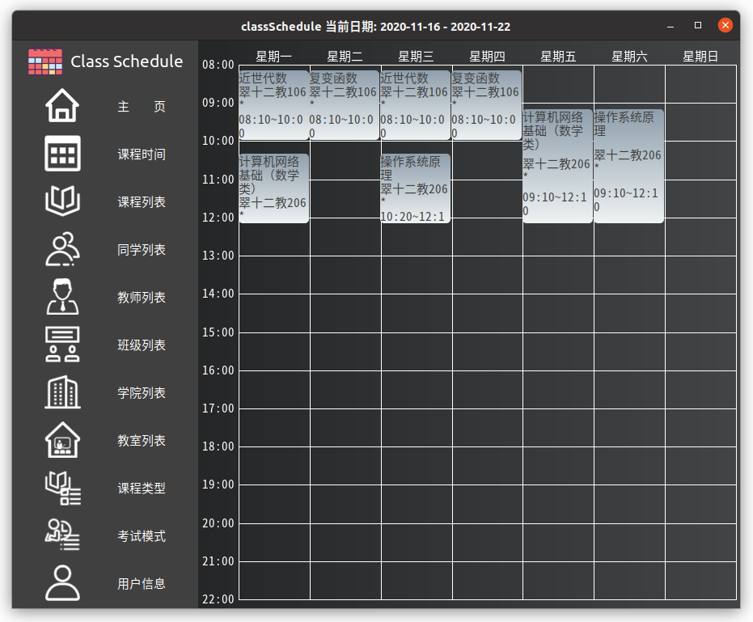
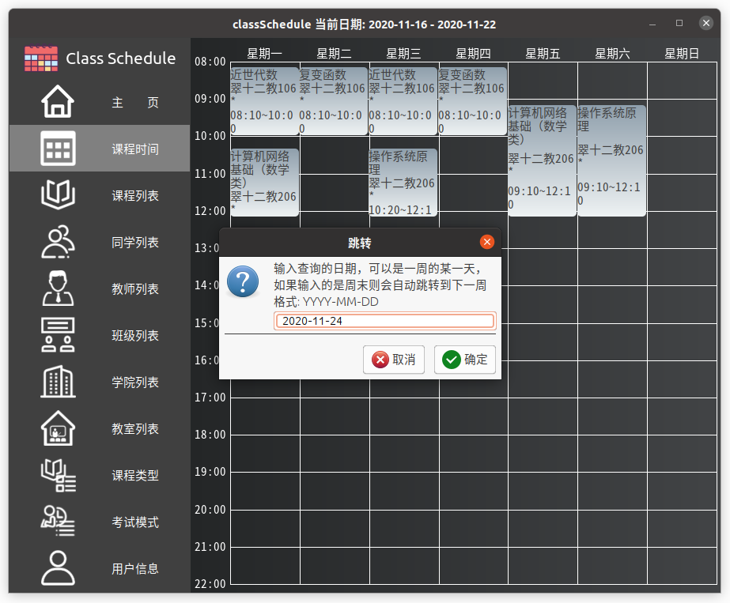
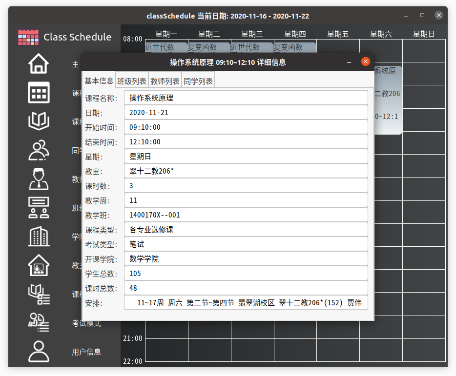
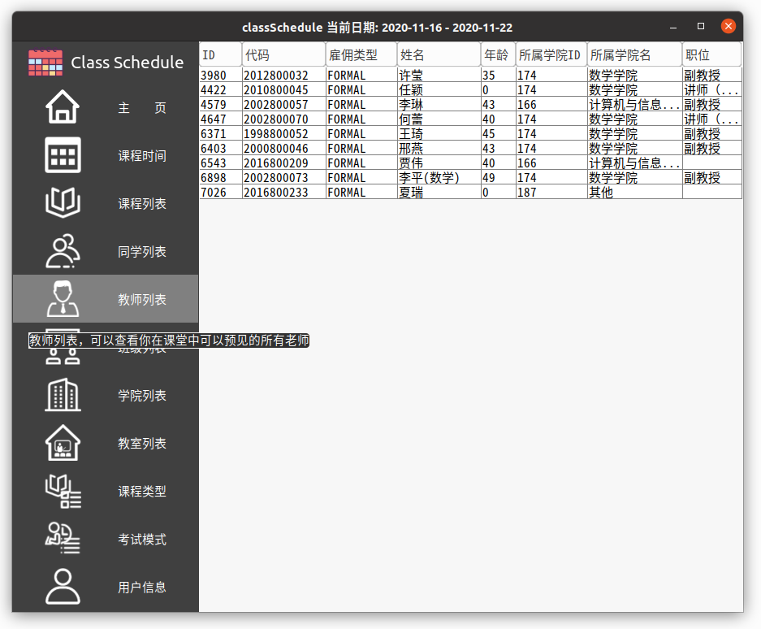
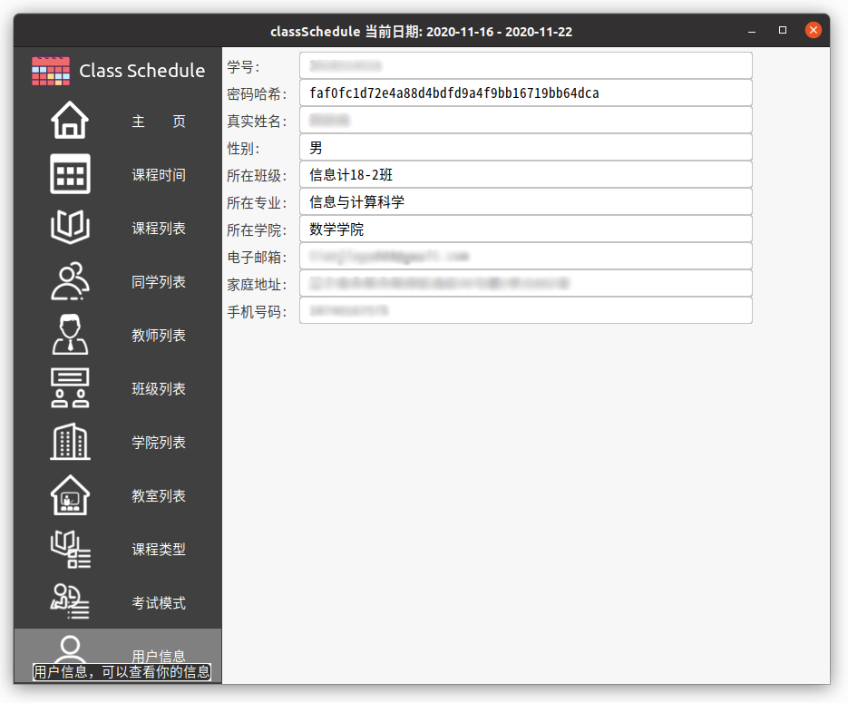

# 客户端

用 Java Swing 实现的合肥工业大学第三方课程表的客户端，尽量模仿了工大的官方教务 APP ，目前功能简单。

## 1. 截图

👆登录界面

👆主界面

👆日期跳转

👆课程安排详细信息

👆教师列表

👆用户信息

## 2. 功能

目前功能很有限，以主界面左侧一列按钮为准：

1. 丑丑的 "Class Schedule" 图标：左键单击可以收起/展开侧边栏
1. 主页：可以回到主界面，标题中会显示当前日期，与下面的星期对应
1. 课程时间：用于进行日期跳转，输入一个合法的日期后客户端会显示日期最近的一周课程表
1. 课程列表：列出用户选的所有课程（基于学期内的教务数据）
1. 同学列表：列出用户可能遇到的所有同学
1. 教师列表：列出用户可能遇到的所有教师
1. 班级列表：列出用户可能遇到的所有同学来自的所有班级
1. 学院列表：列出用户可能遇到的所有同学来自的所有学院
1. 教室列表：列出用户可能进入的所有教室
1. 课程类型：列出所有课程的所有课程类型
1. 考试模式：列出所有课程的所有考试模式
1. 用户信息：列出用户在教务系统中收录的信息